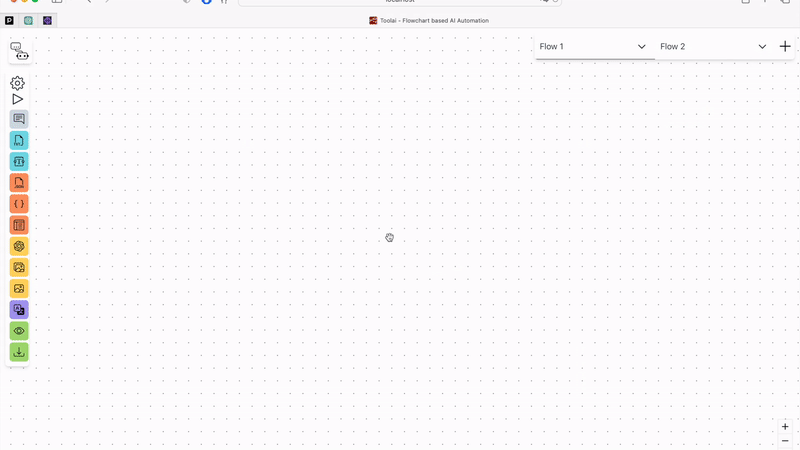

# ToolAi

A highly customizable AI-powered automation tool using flowchart methodology

## Demo of the App

## Installation

## Development server

Run `nx serve toolai` for a dev server. Navigate to http://localhost:4200/. The app will automatically reload if you change any of the source files.

## Understand this workspace

Run `nx graph` to see a diagram of the dependencies of the projects.

## Remote caching

Run `npx nx connect-to-nx-cloud` to enable [remote caching](https://nx.app) and make CI faster.

## API Reference

### React Flow

[Check out the documentation](https://reactflow.dev/)

### AI tools

- [ChatGPT](https://openai.com/blog/chatgpt)
- [Dall-E](https://openai.com/product/dall-e-2)
- [DeepL](https://www.deepl.com/docs-api)

### Functional Flow Components

These Nodes are built to fulfill fundamental tasks that deal with data flows and user input:

- JSON reader
- File Input
- User Functions
- Template
- Text Input
- Preview
- Download

## Authors

- [Aina Perez Serra](https://github.com/ainaperez)
- [Tarik Azale](https://github.com/Deftool66)
- [Theron Burger](https://github.com/theronburger)
- [Julien Look](https://www.github.com/juice1000)
