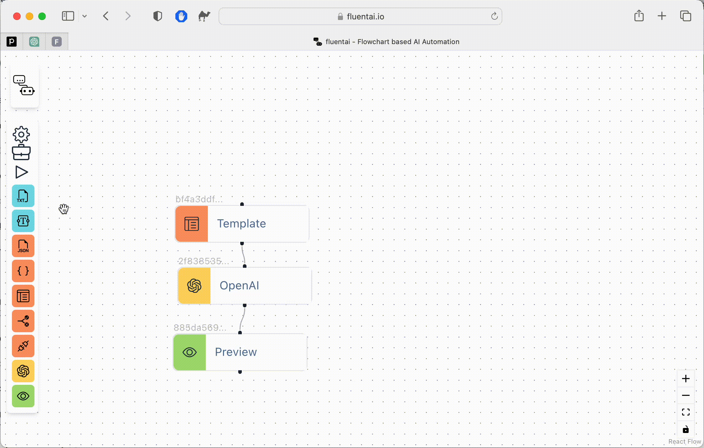

# fluentAI

A low code / no code tool for automating interactions with large language models. Check it out over at [fluentAI.io](http://fluentai.io),

## Stack

We're using a NX Monorepo to encourage breaking code out as libraries. The core application is `apps/fleuntai`

For auth and db were using Supabase.

The app is serverless, calling supabase edge functions for traditional backend tasks. The supabase code is in the apps/supabase project

For testing stuff out your're welcome to use our openAI key, called via supabase edge functions. Each new account gets 20c credit on creation. However as stripe billing is still in the works you can use your own API key via the un app settings.

The UI built using ReactFlow for the workflows and Radix for components.

## Running locally

Run `nx serve fluentai` for a dev server.
